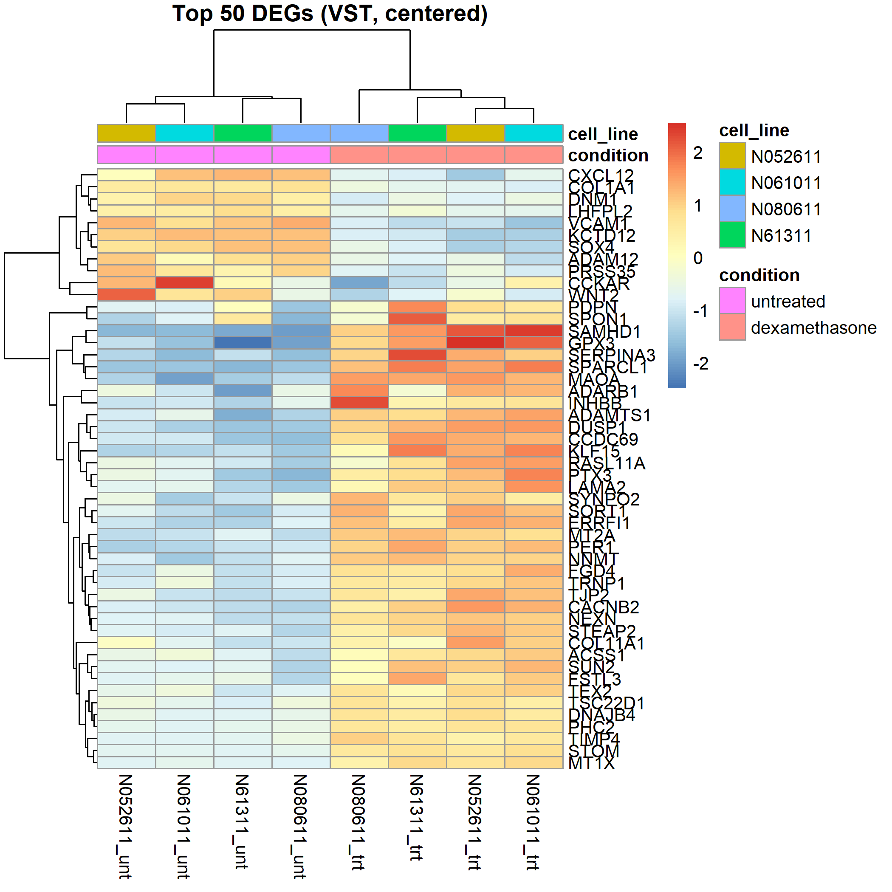

# RNA-seq Differential Expression: Glucocorticoid Response in Airway Smooth Muscle

An end-to-end, fully reproducible RNA-seq workflow — from raw sequencing reads to
differential expression and pathway-level biological interpretation. The entire
pipeline is version-pinned and containerized, so the analysis reproduces from a
single command on any machine.

Demonstrated on a public glucocorticoid-treatment dataset (GSE52778), recovering
the expected anti-inflammatory steroid response.

---

## Overview

This project implements the complete path a transcriptomics analysis takes in
practice:

**raw FASTQ → QC & quantification → differential expression → functional enrichment → interpretation**

It pairs production nf-core/Nextflow pipelines for the sequence processing
stages with a custom R analysis for differential expression and enrichment. Every stage is pinned and reproducible: pipeline and Nextflow versions are fixed, R dependencies are locked with `renv`, and the analysis environment is captured in a Docker image.

The data acquisition and quantification stages are parameterized. Switching to a different study is a one line config change plus a new accession list. The downstream differential expression analysis is specific to the dataset, and the R scripts can be used as a template for analysis of other datasets.

---

## Dataset

**GSE52778** — Himes *et al.*, human airway smooth muscle cells treated with the
glucocorticoid dexamethasone versus untreated controls.

| Property | Value |
|---|---|
| Accession | GSE52778 (SRA study SRP033351) |
| Samples | 8 (4 primary cell lines × treated/untreated) |
| Design | Paired: each cell line sampled both conditions |
| Platform | Illumina HiSeq 2000, paired-end RNA-seq |
| Organism | *Homo sapiens* (GRCh38) |

The paired treated vs untreated structure makes it an ideal differential-expression
benchmark, and the biology is well characterized. A known glucocorticoid response allows the results to be validated against expectation.

---

## Workflow & Stack

| Stage | Tool | Output |
|---|---|---|
| 1. Data acquisition | **nf-core/fetchngs** `1.12.0` | FASTQs (via ENA) + samplesheet |
| 2. QC + quantification | **nf-core/rnaseq** `3.26.0` (Salmon pseudo-alignment) | Gene-level count matrix, MultiQC |
| 3. Differential expression | **DESeq2** | DE results, PCA, MA plot, DEG heatmap |
| 4. Functional enrichment | **clusterProfiler** (GO ORA, KEGG ORA, GO GSEA) | Enriched terms, convergence summary |

Orchestration: **Nextflow** (version-pinned). Analysis: **R** with **Bioconductor**.
Reproducibility: **renv** + **Docker**.

---

## Reproducibility

This is the core engineering goal of the project. Every layer is pinned:

- **Pipeline versions** fixed via Nextflow's `-r` revision flag (`fetchngs 1.12.0`,
  `rnaseq 3.26.0`).
- **Nextflow version** pinned via `NXF_VER` (the pipelines have specific Nextflow
  requirements: `rnaseq 3.26.0` requires Nextflow ≥ 25.04.0).
- **Containerized execution** — every pipeline process runs in a pinned biocontainer
  via `-profile docker`.
- **R dependencies** captured exactly in `renv.lock`.
- **Analysis environment** built into a Docker image (`Dockerfile`) that restores
  `renv.lock` on a matching Bioconductor base image.

The result: `docker build` + `docker run` reproduces the differential expression and
enrichment results from the count matrix, with no manual environment setup.

---

## Repository Structure

```
.
├── README.md
├── Dockerfile                 # reproducible R analysis environment
├── .dockerignore
├── renv.lock                  # pinned R/Bioconductor package versions
├── conf/
│   └── run.config             # Nextflow config profiles
├── assets/
│   └── airway_ids.csv         # SRA accessions for the demonstration dataset
├── run_pipeline.sh            # fetchngs -> rnaseq, version-pinned
├── diff_exp.R                 # DESeq2 differential expression
├── enrichment.R               # GO/KEGG ORA + GSEA, convergence summary
└── results/                   # count matrices, DE tables, plots
```

*(Large/regenerable artifacts: `work/`, FASTQs, the `renv` library —
are gitignored; the lockfiles and configs that regenerate them are tracked.)*

---

## Running It

**1. Acquire data + quantify** (Nextflow + Docker):

```bash
./run_pipeline.sh              # nf-core/fetchngs -> nf-core/rnaseq (Salmon)
```

To run a different dataset: drop a new `assets/<name>_ids.csv`, set
`params.dataset = '<name>'` in `conf/run.config`, and rerun the same script.

**2. Differential expression + enrichment** (R):

```r
renv::restore()                 # install the exact pinned package set
source("diff_exp.R")            # DESeq2 -> results table + QC plots
source("enrichment.R")          # GO/KEGG ORA + GSEA -> enrichment tables
```

**3. Or reproduce the analysis fully containerized:**

```bash
docker build -t rnaseq-de .
docker run --rm -v "${PWD}/results:/project/results" rnaseq-de
```

---

## Key Methodological Decisions

- **Salmon pseudo-alignment** rather than full STAR alignment. Produces the
  gene-level counts needed for DE at a fraction of the memory footprint, making the
  pipeline runnable.
- **Blocked design (`~ cell_line + condition`)**. The experiment is paired, so
  cell line is modeled as a blocking factor to control for baseline donor
  differences and isolate the dexamethasone effect.
- **ORA universe = detected genes**. Overrepresentation is tested against the set
  of genes that could actually be detected in the experiment, not the whole genome,
  avoiding inflated enrichment.
- **ORA *and* GSEA, then convergence**. Overrepresentation (cutoff-based) and GSEA
  (rank-based, no cutoff) are run independently; terms flagged by both GO analyses
  are reported as the highest-confidence findings.

---

## Results & Findings

### Differential expression
- Genes tested: **14529** \
Significant at padj < 0.05: **3910 (26.9%)** \
Upregulated: **2109 (14.5%)** \
Downregulated: **1801 (12.4%)**
- PCA on variance-stabilized counts separates samples by treatment condition, consistent with a real, dominant dexamethasone effect on treated vs control. With access to additional compute and storage, it would be interesting to see the PCA plot for larger sample sizes, as this dataset is quite small.


***Top 50 differentially expressed genes (variance-stabilized, row-centered). Unsupervised clustering separates samples perfectly by treatment, with the four dexamethasone treated samples forming a distinct block from the four untreated controls.***

### Functional enrichment — the expected glucocorticoid signature

**Downregulated** The dominant signal among suppressed processes is immune and inflammatory: chemotaxis/taxis, humoral immune response, and B-cell activation and differentiation. This coordinated suppression of inflammatory gene programs is the canonical, on-target effect of a glucocorticoid.

**Upregulated** Enriched among up-regulated genes: extracellular matrix organization, cell–matrix and focal adhesion, actin cytoskeleton organization, muscle contraction, and response to peptide hormone — consistent with glucocorticoid effects on airway smooth muscle and with hormone stimulation.

**Note about the statistical analysis** Overrepresentation analysis was
strongly significant (adjusted p-values down to ~1e-15). GSEA showed concordant
*directional* trends for the same processes but did not reach significance. This is
expected given only 4 replicates per condition limits the power of a rank-based
test corrected across thousands of gene sets. The findings are therefore reported
as ORA significant with GSEA concordant support.

**Gene-level confirmation of the glucocorticoid response** All five canonical dexamethasone-responsive genes were strongly induced and highly significant: DUSP1 (log2FC +2.9, padj ≈ 1e-128), KLF15 (+4.4, ≈3e-91), PER1 (+3.2, ≈4e-77), FKBP5 (+4.0, ≈2e-26), and TSC22D3/GILZ (+3.0, ≈9e-18). This marker-level recovery of the expected steroid response validates the pipeline and exemplifies the anti-inflammatory signature.

---

## Limitations

- **Demonstration dataset.** GSE52778 is an airway/asthma model, used here as a
  well-characterized benchmark to validate the workflow against known biology.
- **Small replicate count** (n = 4 per condition) limits the power of rank-based
  enrichment (GSEA), as reflected in the results.
- **Symbol-based gene mapping.** Quantification was gene-symbol–keyed; symbols were
  mapped to Entrez IDs via `org.Hs.eg.db`, with **12782/14529 (88.0%)** mapping successfully.
  A minority of symbols have no Entrez equivalent and are dropped, which is a known limitation of symbol-based annotation. Some broadly annotated developmental/neuronal GO terms surface from pleiotropic genes and are not interpreted as biologically central.

---

## References

- Himes BE, *et al.* RNA-Seq transcriptome profiling identifies CRISPLD2 as a
  glucocorticoid-responsive gene in human airway smooth muscle cells. *PLoS ONE*,
  2014. (GSE52778)
- Ewels PA, *et al.* The nf-core framework for community-curated bioinformatics
  pipelines. *Nat Biotechnol*, 2020.
- Love MI, Huber W, Anders S. Moderated estimation of fold change and dispersion for
  RNA-seq data with DESeq2. *Genome Biol*, 2014.
- Wu T, *et al.* clusterProfiler 4.0: A universal enrichment tool for interpreting
  omics data. *The Innovation*, 2021.
